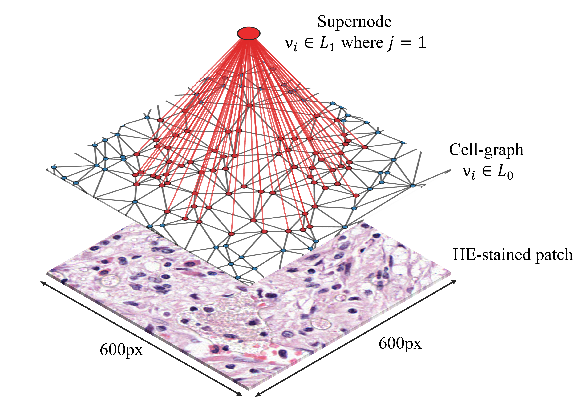
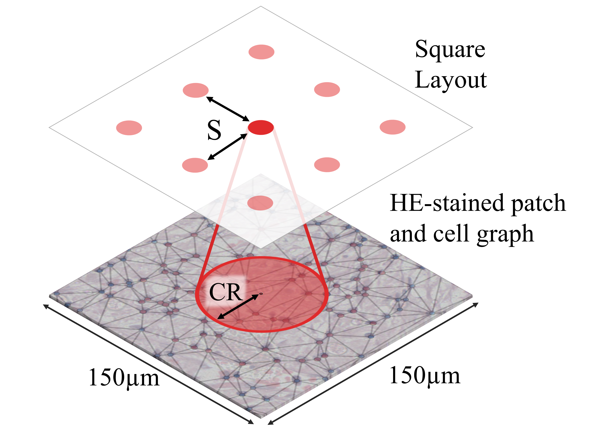
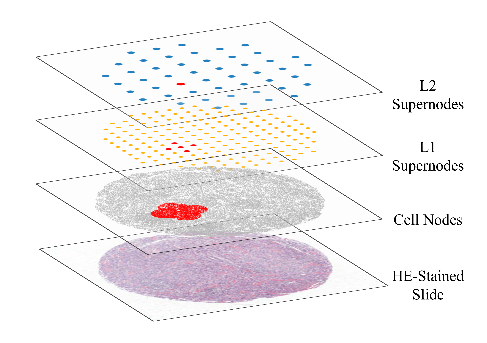

# SNGraph

SNGraph contains the code used for experimenting with hierarchical cell graphs.

*Disclaimer: This code was not written to be super generalisable or as a package.*


## Running Order
Below is a description of each of the codes in the suggested running order. 
For a description of each of the variables contained in the params text file, 
used to specify directories and parameter for each experiment, see the table 
at the bottom of this page.

### 1.  Create Cell Graph from Cell Detections
`python GraphSetup/make_cell_graphs.py <params.txt>`

This code takes a .csv file where each row represents a cell detection and 
each column represents a node feature. These node features contain the x and
y coordinate in pixels (`X(px)` and `Y(px)`) and in micrometers (`X(um)` and 
`Y(um)`). It also contains the cell type such as Tumour, Plasma or Muscle, 
and morphological features such as elongation, size and angle. An example is shown
below. The last column ('sn') will also specify which level the nodes are in the hierarchy. 

| Index  | X(px) | Y(px) | X(px) | Y(px) | p(tumour) | p(plasma) | p(muscle) | elongation | size | angle | sn |
| :----  | :---- | :---- | :---- | :---- | :-------- |:-------------- | :-------- | :--------- | :--- | :---- | :--- |   
| 0      | 94614 | 79778 | 23300 | 19469 | 0.743     | 0.057          | 0.200     | 1.245      | 15.8 | 2.24  | 0  |
| 1      | 94617 | 79750 | 23328 | 19440 | 0.352     | 0.509          | 0.139     | 1.679      | 20.1 | 0.53  | 0  |
| ...    | ... | ... | ... | ... | ...     | ...          | ...     | ...      | ... | ...  | ... |

It applies Delaunay triangulation to the locations of the cells and creates a file containing edges with
specific attributes such as distance in micrometers. Below is an example.

| source  | target | distance |
| :-----  | :----- | :---- | 
| 0       | 1      | 32.56 |
| 0       | 15     | 26.12 |
| ...     | ...    | ...   | 

This first code also sets up the project directory and files. This script will set up the following environment. 

```
├── Project
│   ├── Graphs
│   │   ├── SN0
│   │   │   ├── NodeFiles
│   │   │   │    ├── file0.csv
│   │   │   ├── EdgeFiles
│   │   │   │    ├── file0.csv
```

### 2. Creating the first set of hierarchical nodes (supernodes)

`python make_sn1s.py <params.txt>`

This script will take the locations of the cell detections and create a set of 
nodes called supernodes (SNs), that form hierarchical connections with the cell 
detections. A visual illustration is provided below. 



In this code there are a few key parameters to be specified. These are the 
separation (S) of the SNs, the connection radius (CR) of the SNs as
a factor of S, and the layout which can either be `square` or `isometric`. 
The figure below illustrates these parameters. 



The script will create a new set of cell detection and edge .cvs files with 
the new hierarchical nodes and hierarchical edges. These will be put into a new 
set of directories. The project environment will now appear as below. 

```
├── Project
│   ├── Graphs
│   │   ├── SN0
│   │   │   ├── NodeFiles
│   │   │   ├── EdgeFiles
│   │   ├── SN1
│   │   │   ├── NodeFiles
│   │   │   │    ├── file0.csv
│   │   │   ├── EdgeFiles
│   │   │   │    ├── file0.csv
```

### 3. Creating the second set of supernodes

`python GraphSetup/make_sn1s.py <params.txt>`

This script will take the location of the cells and previous set of SNs and
create another set of hierarchically connected nodes. 
The output of this process is visualised below. 



The script will create a new set of cell detection and edge .cvs files with 
the new hierarchical nodes and hierarchical edges. These will be put into a new 
set of directories. The project environment will now appear as below. 

```
├── Project
│   ├── Graphs
│   │   ├── SN0
│   │   │   ├── NodeFiles
│   │   │   ├── EdgeFiles
│   │   ├── SN1
│   │   │   ├── NodeFiles
│   │   │   ├── EdgeFiles
│   │   ├── SN2
│   │   │   ├── NodeFiles
│   │   │   │    ├── file0.csv
│   │   │   ├── EdgeFiles
│   │   │   │    ├── file0.csv
```

### 4. Confirming that the SNs were created successfully

`python GraphSetup/plot_sns.py <params.txt> 2`

This file will display the level of supernodes specified by the final argument
('2' in the example above.) and will ask you to select the index of a SN
you would like to see the connections of. It will then display these connections. 

### 5.1 Node classification 

1. `python TrainTest/node_classifcation.py <params.txt>`

2. `python TrainTest/eval_node_classifcation.py <params.txt>`

These scripts are the most flexible with variables. You can specify the number of 
epochs to train for, the number of cross validation folds, number of message 
passing steps within the model, number of hidden features between each message
passing step, etc.

Once the model has trained for all epochs using the first script, you can 
specify which model to use for the evaluation by specifying the epoch in the second script.
It will then obtain the mean accuracy and balanced accuracy across all cross-validation folds.

Running these scripts will introduce some directories to keep log the progress
of training, store the models at each checkpoint and record the losses and 
evaluation metrics. The resulting project environment will look like below. 

```
├── Project
│   ├── Graphs
│   │   ├── SN0
│   │   │   ├── NodeFiles
│   │   │   ├── EdgeFiles
│   │   ├── SN1
│   │   │   ├── NodeFiles
│   │   │   ├── EdgeFiles
│   │   ├── SN2
│   │   │   ├── NodeFiles
│   │   │   ├── EdgeFiles
│   ├── LogFiles
│   ├── Models
│   ├── Metrics
```

For these scripts the output class has to be specified for each cell node must
be specified using the column name 'class'. Unannotated nodes should be specified
with the label '**notype**'. The model is trained using a 
weighted masked mean squared error loss and will use the 'notype' annotation to
determine the mask. 

### 5.2 Weakly supervised relative risk prediction

1. `python TrainTest/risk_prediction.py <params.txt>`

2. `python TrainTest/eval_risk_prediction.py <params.txt>`

These scripts are flexible similar to those in Section 5.1. There are a range
of parameters that can be varied in the param.txt file, such as the number of 
hidden nodes in the final pooling operation, number of message steps, etc.

These script assume that you **have not** already run the node classification 
task in this project environment. The reason is that these script will create 
the same environment structure as it is treated like a separate project. The 
resulting structure will be the same as that in Section 5.1.


```
├── Project
│   ├── Graphs
│   │   ├── SN0
│   │   │   ├── NodeFiles
│   │   │   ├── EdgeFiles
│   │   ├── SN1
│   │   │   ├── NodeFiles
│   │   │   ├── EdgeFiles
│   │   ├── SN2
│   │   │   ├── NodeFiles
│   │   │   ├── EdgeFiles
│   ├── LogFiles
│   ├── Models
│   ├── Metrics
```

The output from these scripts will not be the accuracy but the concordance index. 
In the paper that accompanies this code, we measure HR, however we are unable to 
publicly provide the survival data for these patients. However, the structure
of this data is one column specifying the time-to-event (for example '12' months),
the name of the event (for example 'recurrence or death') and what the name of 
the event is which can be converted to binary (for example if 'recurrence or death'
is specified then this will be converted to '1' and 'alive' will be '0').
These scrips also considered censored data.

Something to consider that is in this script is that we are using cell detections
that correspond to tissue microarray (TMA) cores. Each patient had 2 TMA cores. 
For the cross validation, patients were partitioned so that both cores were in the
same set and not split across train and validation sets, which would lead to data
leakage. Furthermore, only patients whose cores contained only tumour epithelium
and not normal epithelium were used, which was specified in the dataset and can be see
in these scripts.

## Parameters

Below is a table with descriptions of the parameters that are used by the codes throughout this experiment.


| Parameter Name      | Default                 | Desceiption                                              |
| :-----              | :-----                  | :----                                                    | 
| ATT_FEATURES        | 8                       | The number nodes in in the pooling of the attention network.
| BATCH_SIZE          | 4                       | The number of graphs in a batch.
| CV_PATH             | -                       | The path to the cross validation file containing information about which graphs are in which split. This file will contain one column called 'id' which will contain the name of node and edge files. There will be a column for each of the folds that will specify 'train', 'val' or 'test'. |
| EDGE_FEATURES       | -                       | This will be a list of the edge feature column names. For example 'length'.
| EPOCHS              | 10000                   | The total number of epochs to train for. 
| EVENT_DUR           | DFS_5year_month         | In the .csv file containing survival information, this is the column containing the time-to-event data. 
| EVENT_POS           | recurrence or death     | In the EVENT_STAT column  of the survival data, this is the label for an experienced event. 
| EVENT_STAT          | DFS_5year_status        | In the .csv file containing survival information, this is the column containing the event status. For example 'alive' or 'died'.
| FOLD                | 0                       | Only one fold is trained at a time due to HPC time limits. Specify the fold to train. 
| GRAPH_DIR           | <project>/Graphs        | The directory in the project environment where all of the graphs will be saved.
| HIDDEN_FEATURES     | 64                      | The number of hidden features between message passing steps for GNNs consisting of >1 message passing step.
| IN_FEATURES         | -                       | The node features to use in training. For example the probability of the node being a specific node type or morphological features. 
| LAYOUT              | square                  | The layout for the configuration of the first set of supernodes. Options are 'square' or 'isometric'
| LOG_DIR             | <project>/LogFiles      | Whenever training is started, a new log file is created to keep track of the code. This is where these files are stored. 
| LR                  | 1e-4                    | The model learning rate.
| METRIC_DIR          | <project>/Metrics       | During training and evaluation, files containing metrics such as accuracy are stored in this directory. 
| MODEL_DIR           | <project>/Models        | This is where models are stored at every specified interval. (see SAVE_EPOCHS).
| NAME                | <project>               | This is the name of the project and will be the prefix for all models and output files. 
| NOISE_ATT           | 1                       | This is an augmentation term for the edge features. 
| NOISE_EDGES         | 1                       | This another augmentation term for the edge features, specifying how much to augment them. 
| NORMALISE_CM        | True                    | In the node classification task, confusion matrices are produced. If specified True then the confusion matrix will be normalised. 
| NOISE_CELLS         | 0.1                     | If not None, then this is the standard deviation of a normal distribution from which noise is sampled from and added to the node features. 
| N_MESSAGE_PASSING   | 1                       | The number of message passing steps within the GNN.
| OUT_FEATURES        | -                       | A list of outputs when performing node classification.
| PROJECT_DIR         | <project>               | This is the directory on the machine your using, where the project will be created. 
| RADIUS              | 1                       | This is the connection radius for the L1 supernodes. It is specified as a factor of the L1 supernode separation (see SEPARATION).
| SAVE_EPOCHS         | 100                     | This specifies the number of epochs to checkpoint the model and retrieve evaluation metrics on the train and validation sets. 
| SEPARATION          | 140                     | This is the separation of the L1 supernodes, specified in micrometers (um).
| SHUFFLE             | False                   | If True then the dataloaders will shuffle the batches. 
| SN0_DIR             | <project>/Graphs/SN0    | This is where the node and edge files will be stored for the cell detections. 
| SN1_DIR             | <project>/Graphs/SN1    | This is where the node and edge files containing the cell detections and the L1 supernodes will be stored. 
| SN2_DIR             | <project>/Graphs/SN2    | This is where the node and edge files containing the cell detections, L1 and L2 supernodes will be stored.
| SN2_RADIUS          | 1                       | This is the connection radius of the L2 supernodes, specified as a factor of the L2 supernode separation.
| SN2_SEPARATION      | 2                       | This is the separation of the L2 supernodes, specified as a factor of the L1 supernode separation.
| SURV_FILE           | -                       | This is the path to the .csv file containing the survival information
| THRESHOLD           | None                    | If specified, edges greater than this threshold will be pruned. 
| XPX_COL             | X(px)                   | The column name containing the X coordinates of the nodes in pixels.
| X_COL               | X(um)                   | The column name containing the Y coordinates of the nodes in pixels.
| YPX_COL             | Y(px)                   | The column name containing the X coordinates of the nodes in micrometers.
| Y_COL               | Y(um)                   | The column name containing the Y coordinates of the nodes in micrometers.


